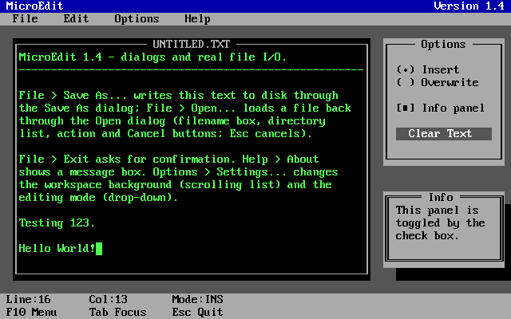
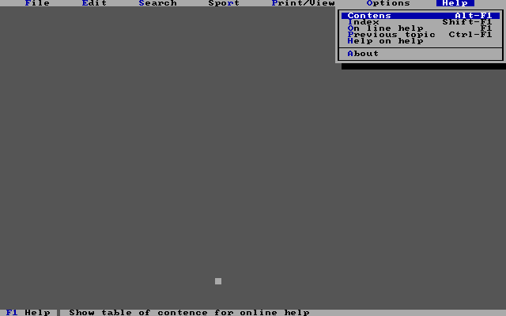

# **MicroApp**<br>*Text Mode Application Framework for MS-DOS*


<p align="center">
  &emsp;  
  
</p>

## 📑 Table of Contents

- [✨ Features](#-features)
- [🧩 Component Library](#-component-library)
- [🚀 Quickstart](#-quickstart)
- [🔨 Build MicroEdit](#-build-microedit)
- [📂 Repository Structure](#-repository-structure)
- [🔗 Dependencies](#-dependencies)
- [⚙ Technical Details](#-technical-details)
- [📄 License](#-license)

<br>

## ✨ Features

**MicroApp** is a C++ text-mode application framework for MS-DOS inspired by the Turbo C++ style test user interface. **MicroApp** is built on top of the [**MicroText**](https://github.com/rohingosling/micro-text) library. **MicroApp** offers an application engine that supports a menu bar, dialog panels with drop shadows, focus and layer management, and a double buffred component tree for smooth animation. 

- A single `Component` base class with a parent/child tree, focus handling, and event dispatch. Every component derives from it.
- Modal dialogs that draw with a drop shadow and restore the exact background they covered on close.
- A full menu system with `MenuBar`, `Menu`, and `MenuItem`, including keyboard shortcut labels and drop-down navigation.
- Built in file dialogs with DOS `findfirst` / `findnext` directory enumeration.
- Application `TitleBar`, `StatusBar`, and `ApplicationPanel`.
- An `Application` class that owns the main loop, the screen buffer, and the double buffering. Consumers of the class subclass it and register components.
- Flicker-free rendering inherited from MicroText double buffering. The whole component tree composites off-screen, then blits to `0xB800` in one `REP MOVSW`.

<br>

## 🧩 Component Library

| Group | Classes |
|-------|---------|
| Core | `Component`, `Panel`, `Application`, `ApplicationPanel` |
| Basic controls | `Label`, `Button`, `TextBox`, `CheckBox` |
| Selection | `RadioButton`, `RadioButtonGroup`, `Group` |
| Lists | `ListItem`, `ListBox`, `DropDownTextBox` |
| Menus | `MenuBar`, `Menu`, `MenuItem` |
| Utility | `TitleBar`, `StatusBar` |
| Dialogs | `Dialog`, `MessageBox`, `ConfirmationBox` |
| File dialogs | `FileDialog`, `NewFileDialog`, `FileOpenDialog`, `FileSaveAsDialog` |

<br>

## 🚀 Quickstart

MicroApp ships as two source pairs — the framework itself (`src/M-APP/`) and its vendored MicroText dependency (`src/M-TEXT/`). Add all four files to your project, include both headers, and compile the three modules together. There is nothing to install.

```cpp
#include "mtext.h"
#include "mapp.h"
```

Compile with the Borland C++ 3.1 command-line driver, large memory model:

```dos
bcc -c -ml -2 -I..\src\M-TEXT ..\src\M-TEXT\mtext.c
bcc -c -ml -I..\src\M-TEXT -I..\src\M-APP ..\src\M-APP\mapp.cpp
bcc -c -ml -I..\src\M-TEXT -I..\src\M-APP myapp.cpp
bcc -ml -emyapp.exe mtext.obj mapp.obj myapp.obj
```

The large memory model (`-ml`) is required throughout — MicroText's `TEXTBUFFER` cells are `far` pointers and off-screen buffers come from `farmalloc`. MicroText is compiled with `-2` (80286); MicroApp itself has no CPU-specific requirement beyond what MicroText imposes.

For a complete worked example, read `test/test.cpp` — MicroEdit is a real, working editor in a single file.

<br>

## 🔨 Build MicroEdit

The `test/` directory holds **MicroEdit**, a minimal text editor that serves as both the framework's validation harness and its reference application. It exercises the whole component library: File New/Open/Save/Save As through the file dialogs, a Settings dialog built from a `ListBox` and a `DropDownTextBox`, an About `MessageBox`, an exit `ConfirmationBox`, and real file input/output on small plain-text files.

Requires MS-DOS, or a DOS emulator like [DOSBox](https://www.dosbox.com/), with the Borland C++ 3.1 command-line driver (`bcc`) on the `PATH`. Run from the `test/` directory inside an already-configured DOSBox session:

```dos
cd test
BUILD.BAT
TEST.EXE
```

The `.obj` files, `TEST.EXE`, and `BUILD.LOG` all land in `test/`. Run `BUILD.BAT clean` to remove them.

<br>

## 📂 Repository Structure

```
Micro App
├─ src               Framework source
│  ├─ M-APP          MicroApp - C++ TUI component framework
│  │  ├─ mapp.cpp    Implementation
│  │  └─ mapp.h      Public API
│  │
│  └─ M-TEXT         MicroText - vendored dependency
│     ├─ mtext.c     Implementation (C + inline x86 asm)
│     └─ mtext.h     Public API
│
├─ test              MicroEdit - the reference application
│  ├─ build.bat      Builds TEST.EXE (build clean to remove artifacts)
│  └─ test.cpp       MicroEdit source
│
├─ README.md
└─ LICENSE
```

<br>

## 🔗 Dependencies

MicroApp depends on **[MicroText](https://github.com/rohingosling/micro-text)**, a low-level text-mode library written in C and inline x86 assembly.

A copy of MicroText is **vendored** into this repository under `src/M-TEXT/`, so the framework builds standalone with no external checkout. The canonical MicroText source lives in its [own repository](https://github.com/rohingosling/micro-text); the copy here tracks it and is refreshed when MicroText changes.

<br>

```
  ┌──────────────────────────┐
  │         MicroApp         │
  └────────────┬─────────────┘
               │
               ▼
  ┌──────────────────────────┐
  │        MicroText         │
  └──────────────────────────┘
```

<br>

## ⚙ Technical Details

- **Target OS:** MS-DOS 3.30, or above.
- **Target CPU:** 80286 / 80386 / 80486, real mode (MicroText compiles with `-2`; a plain 8086 is not supported).
- **Memory model:** Large (`-ml`), far code + far data, with `farmalloc`-ed off-screen buffers.
- **Display:** Direct `0xB800` hardware text mode (80×25, or 43/50 rows), one word per cell (character + attribute).
- **Double buffering:** The component tree composites into an off-screen `TEXTBUFFER`, then a single `FlipScreenBuffer` (`REP MOVSW`) blits it to `0xB800`, flicker-free.
- **Dialog rendering:** Modal dialogs snapshot the region they cover with `GetTextBlock`, draw themselves plus a `PutShadow` drop shadow, and restore the exact background with `PutTextBlock` on close.
- **Toolchain:** Borland C++ 3.1 (`bcc`), with MicroText's `asm { }` blocks handled by the built-in inline assembler with no separate TASM pass.

### Projects Using MicroApp

- **[Data Probe](https://github.com/rohingosling/data-probe)** — A full-screen DOS HEX editor built on MicroApp.
- **Perfect Ten** — A sports and competition score management program. *(Never completed)*

<br>

## 📄 License

Released under the [MIT License](LICENSE) — Copyright © 1992 Rohin Gosling.
